# Raport z przedmiotu Pracownia Problemowa

## Prognozowanie produkcji OZE (wiatr, fotowoltaika) w Polsce

Autorzy: Joanna Hełdak, Łukasz Sądej

---

## Spis treści

1. [Przygotowanie zbioru danych](#1-przygotowanie-zbioru-danych)
2. [Prognozowanie produkcji PV](#2-prognozowanie-produkcji-pv)
3. [Prognozowanie produkcji wiatrowej FW](#3-prognozowanie-produkcji-wiatrowej-fw)

---

## 1. Przygotowanie zbioru danych

### 1.1. Cel i źródła danych

Celem części projektu realizowanej w ramach Pracowni Problemowej było prognozowanie godzinowej produkcji energii ze źródeł odnawialnych
(fotowoltaika – PV oraz farmy wiatrowe – FW) dla całej Polski. Horyzont prognozy wynosi **24 godziny**, a długość zbioru walidacyjnego to **5–7 dni**.

Wykorzystano dwa źródła danych:

| Źródło            | Zawartość                                                      |
| ----------------- | -------------------------------------------------------------- |
| `fw_pv.xlsx`      | Godzinowa łączna produkcja PV i FW dla całej Polski (dane PSE) |
| 16 plików `*.csv` | Godzinowe dane pogodowe dla każdego z 16 województw            |

Plik `fw_pv.xlsx` zawiera dwie kolumny produkcji wyrażone w **MWh (megawatogodziny)** – jest to ilość energii wytworzonej w ciągu danej godziny przez wszystkie instalacje danego typu w Polsce łącznie. Ponieważ krok czasowy wynosi 1 godzinę, wartości te są równoważne średniej mocy w MW.
Przedrostek `his-wlk-cal` oznacza _historical – large-scale calibrated_ (dane historyczne skalibrowane na skalę krajową).

Dla każdego województwa dostępnych jest **9 zmiennych pogodowych**: temperatura powietrza, wilgotność względna, opady deszczu, opady śniegu, temperatura gleby, wilgotność gleby, prędkość wiatru, punkt rosy oraz promieniowanie słoneczne.

### 1.2. Czyszczenie danych produkcyjnych

W danych produkcji PV wykryto braki (wartości `NaN`):

- końcowe wiersze pliku (brak najnowszych odczytów) – zostały odcięte, aby nie tworzyć sztucznych trendów przez interpolację,
- pojedyncze braki w środku szeregu – uzupełniono interpolacją liniową.

#### Produkcja PV

Analiza wykazała, że przez **ok. 25% czasu produkcja PV wynosi blisko zero** (godziny nocne).

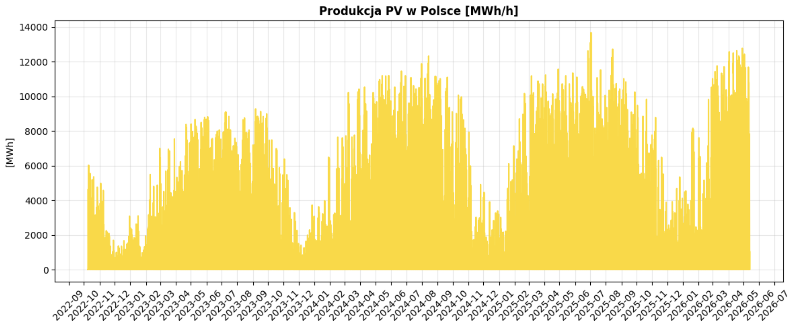

Na wykresie przebiegu czasowego widać duże spadki produkcji PV w miesiącach zimowych – trend ten
powtarza się we wszystkich latach. Dodatkowo produkcja rośnie z roku na rok (najwyższe dni produkcyjne każdego kolejnego roku przewyższają rekordy z roku poprzedniego), co może wynikać najzwyczajniej z ilości instalacji fotowoltaicznych rosnącej z roku na rok.

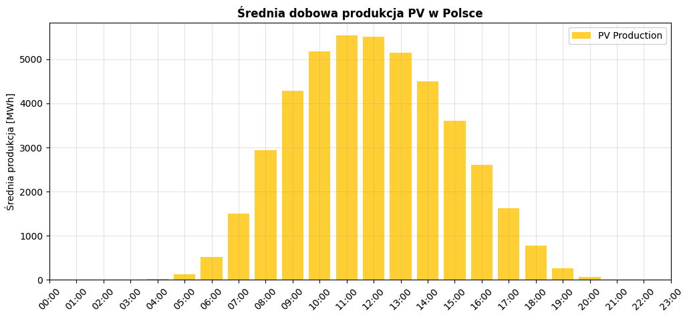
Zgodnie z oczekiwaniami produkcja PV koncentruje się w najbardziej nasłonecznionych godzinach dnia – im wyżej słońce, tym większa produkcja.

### 1.3. Inżynieria cech

Dane pogodowe 16 województw połączono z danymi produkcji po wspólnej kolumnie czasu (`Date`), stosując złączenie wewnętrzne (`inner join`), aby zachować tylko godziny z kompletem danych.

Następnie dodano:

- **cechy czasowe cykliczne** (kodowanie sin/cos): godzina doby, dzień roku, miesiąc, dzień
  tygodnia. Dzięki temu model traktuje np. godziny 23:00 i 00:00 jako sąsiednie, a nie skrajnie
  różne wartości,
- **flagi binarne**: czy noc / czy weekend,
- **agregaty krajowe** dla każdej zmiennej pogodowej: średnia (`PL_mean_*`) i odchylenie
  standardowe (`PL_std_*`) po wszystkich województwach.

Końcowy zbiór `dataset_full.csv` zawiera **10 853 wiersze i 179 kolumn**, obejmując okres od **2025-02-15** do **2026-05-13**. Zatem **177** cechy wejściowe modelu to:

| Grupa cech                                 | Liczba |
| ------------------------------------------ | ------ |
| Cechy pogodowe per województwo (16 × 9)    | 144    |
| Agregaty krajowe (`PL_mean_*`, `PL_std_*`) | 18     |
| Cechy czasowe (cykliczne + flagi)          | 15     |

### 1.4. Eksploracja danych – korelacje

#### Produkcja PV

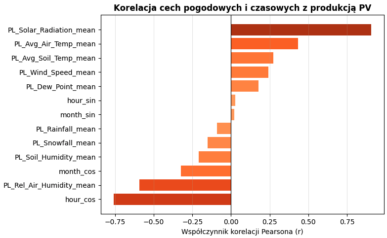

Analiza korelacji potwierdza, że średnie krajowe wartości pogodowe (zwłaszcza promieniowanie słoneczne) oraz cykliczne cechy czasowe są silnie powiązane z wielkością produkcji PV.

### 1.5. Podziały zbioru

Przygotowano dwa niezależne podziały danych:

**Podział 1 – walidacja na ostatnich 7 dniach** (standardowy test prognozy)

W przypadku predykcji pv zrealizowano:
| Plik | Wiersze | Zakres |
|---|---|---|
| `dataset_train.csv` | 10 684 | 2025-02-15 → 2026-05-06 |
| `dataset_val.csv` | 169 | 2026-05-06 → 2026-05-13 (7 dni) |

**Podział 2 – test na dniach słonecznych** (test w warunkach wysokiej produkcji)

W przypadku predykcji pv zrealizowano:

Z puli dni o najwyższej średniej produkcji (powyżej 85. kwantyla) wybrano losowo po jednym dniu z każdego miesiąca. Te dni stanowią zbiór walidacyjny, a pozostałe dane – zbiór treningowy.

| Plik                      | Wiersze | Opis                           |
| ------------------------- | ------- | ------------------------------ |
| `dataset_sunny_train.csv` | 10 709  | cały zbiór bez dni słonecznych |
| `dataset_sunny_val.csv`   | 144     | 6 dni słonecznych × 24h        |

---

## 2. Prognozowanie produkcji PV

Praca znajduje się w notatniku `pv_work/models_pv.ipynb`. Porównano dwa modele uczenia głębokiego oraz przeprowadzono analizę ważności cech (SHAP i LIME).

### 2.1. Konfiguracja eksperymentu

| Parametr                  | Wartość                                  |
| ------------------------- | ---------------------------------------- |
| Okno wejściowe (lookback) | 48 godzin                                |
| Horyzont prognozy         | 24 godziny                               |
| Liczba cech wejściowych   | 177                                      |
| Skalowanie                | `StandardScaler`                         |
| Sekwencje                 | metoda przesuwnego okna (sliding window) |

Dane przekształcono do postaci sekwencji `(liczba_okien, 48, 177)` → `(liczba_okien, 24)`.

### 2.2. Modele

Zaimplementowano dwa modele od podstaw w PyTorch:

**TSMixer** – architektura oparta wyłącznie na warstwach MLP. Liczba parametrów: **461 742**.

**PatchTST** – architektura oparta na transformerze. Liczba parametrów: **200 408**.

Trening wykorzystuje optymalizator AdamW, harmonogram cosine annealing, funkcję straty MSE oraz
wczesne zatrzymanie (early stopping).

### 2.3. Wyniki – walidacja na ostatnich 7 dniach

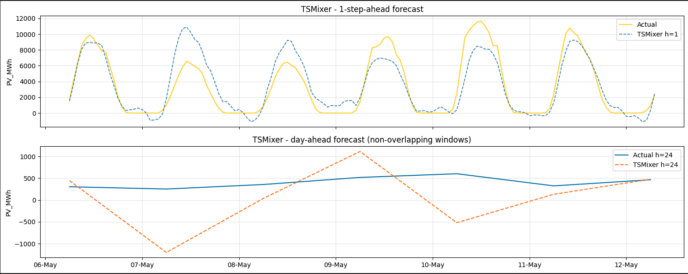

Dla prognozy krótkoterminowej (h=1, z godzinnym wyprzedzeniem) TSMixer wykazuje wysoką precyzję, poprawnie wychwytując punkty zwrotne (spadek produkcji o zmierzchu, wzrost o poranku). Natomiast w prognozie dzień w przód (h=24) pojawiają się znaczne rozbieżności (wysoki błąd MAPE ok. 300%).

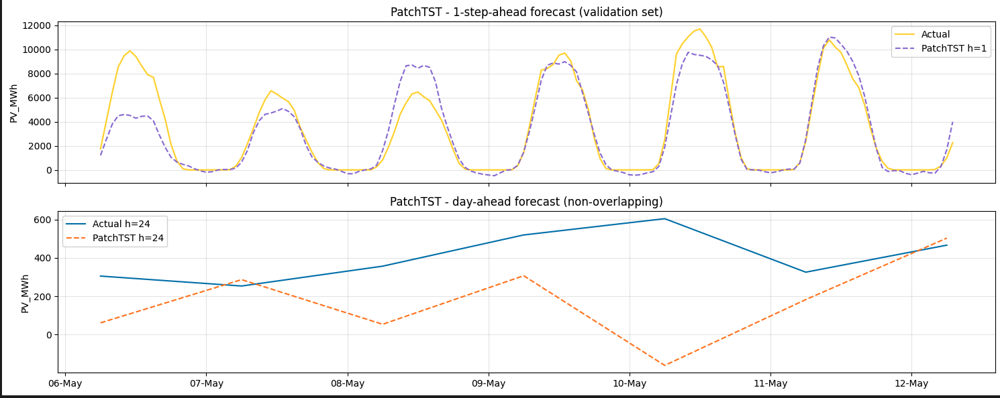

Model PatchTST lepiej radzi sobie z długim horyzontem (h=24) – linia predykcji dużo dokładniej odwzorowuje rzeczywistą produkcję (Należy popatrzyć na wartości na osi y).

**Tabela metryk (walidacja 7-dniowa):**

| Model                  | MAE     | RMSE     | sMAPE (%) | R²       | Skill Score | MAE dzień | MAPE dzień (%) | R² dzień |
| ---------------------- | ------- | -------- | --------- | -------- | ----------- | --------- | -------------- | -------- |
| Persistence (baseline) | 3863    | 5079     | 151.0     | −0.97    | 0.00        | 4114      | 356.0          | −1.24    |
| TSMixer                | 1355    | 1834     | 99.2      | 0.74     | 0.65        | 1703      | 79.4           | 0.60     |
| **PatchTST**           | **776** | **1247** | **89.2**  | **0.88** | **0.80**    | **1078**  | **39.2**       | **0.80** |

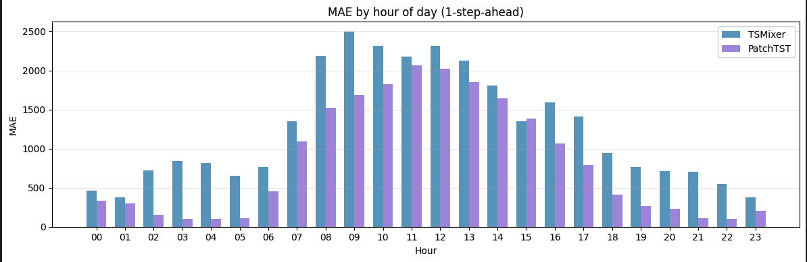

**Wnioski:**

- **PatchTST** lepiej poradził sobie z zadaniem (niższe MAE/RMSE, wyższy Skill Score 0.80).
- Wysoka wartość MAPE wynika z porównań do produkcji bliskiej zeru w godzinach nocnych – dlatego raportujemy też metryki liczone tylko dla godzin dziennych (MAPE dzień, R² dzień).
- Skill Score > 0 oznacza, że oba modele są lepsze od naiwnego baseline (persistence), poza tym widać to na wartościach również innych metryk.

### 2.4. Analiza ważności cech – SHAP na lepszym modelu PatchTST

Globalna ważność cech wg SHAP (najważniejsze 25 cech):
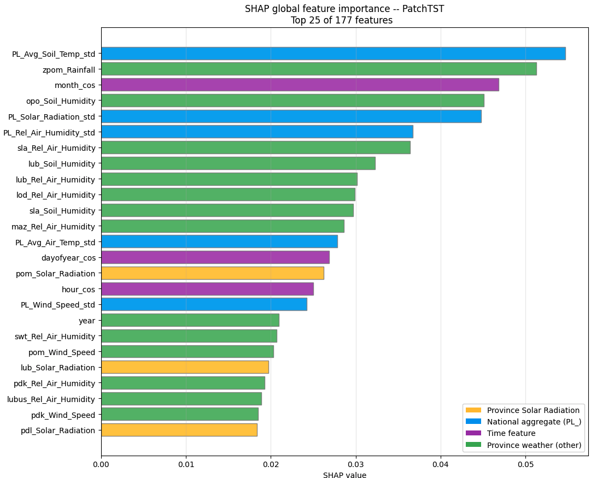

Analiza SHAP pokazuje, które cechy najsilniej wpływają na prognozę. Wśród najważniejszych znalazły się agregaty krajowe (m.in. odchylenie standardowe temperatury gleby i promieniowania słonecznego) oraz cechy czasowe (`month_cos`, `dayofyear_cos`).

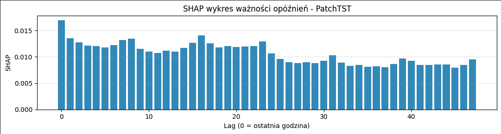

W prognozie krótkoterminowej kluczowe znaczenie ma najświeższa dostępna godzina (Lag 0). Wartości głębiej w przeszłości mają mniejszy wpływ jednostkowy, ale model efektywnie agreguje informację z całego 48-godzinnego okna – nie opiera się więc na naiwnej ekstrapolacji ostatniego punktu, lecz wykorzystuje szerszy kontekst meteorologiczny i dobową cykliczność.

### 2.5. Analiza ważności cech – LIME oraz porównanie z SHAP

Wyjaśnienia LIME dla wybranych charakterysyucznych godzin:
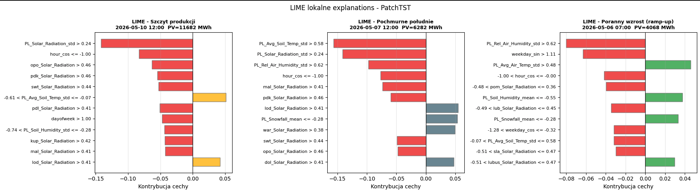

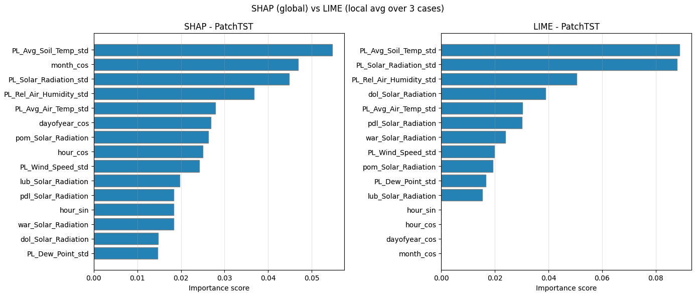

Oba podejścia (globalne SHAP i lokalne LIME) wskazują zbliżony zestaw najważniejszych cech – zwłaszcza krajowe odchylenia standardowe temperatury gleby, promieniowania słonecznego i wilgotności powietrza, co wzmacnia zaufanie do interpretacji modelu.

### 2.6. Wyniki – walidacja na dniach słonecznych

W tym teście modele wytrenowano od nowa na zbiorze pozbawionym dni słonecznych, a następnie wykonano prognozę day-ahead (48h kontekstu → 24h prognozy) dla każdego z 6 wybranych dni.

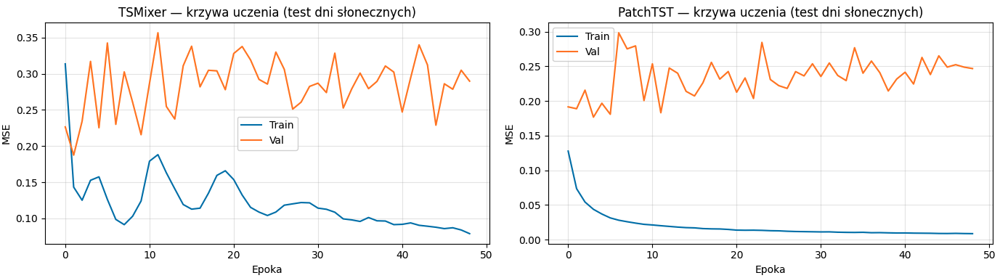
Krzywe uczenia mają zbliżony kształt do walidacji 7-dniowej, natomiast wartości metryk poprawiły się znacząco, szczególnie dla TSMixer.

**Tabela metryk (dni słoneczne):**

| Model                  | MAE     | RMSE    | sMAPE (%) | R²       | Skill Score | MAE dzień | MAPE dzień (%) | R² dzień |
| ---------------------- | ------- | ------- | --------- | -------- | ----------- | --------- | -------------- | -------- |
| Persistence (baseline) | 3896    | 5675    | 134.7     | −0.89    | 0.00        | 6032      | 100.0          | −2.70    |
| TSMixer                | 835     | 1117    | 92.5      | 0.93     | 0.79        | 994       | 57.5           | 0.88     |
| **PatchTST**           | **581** | **838** | **84.0**  | **0.96** | **0.85**    | **777**   | **27.2**       | **0.92** |

Prognozy dla poszczególnych dni słonecznych:

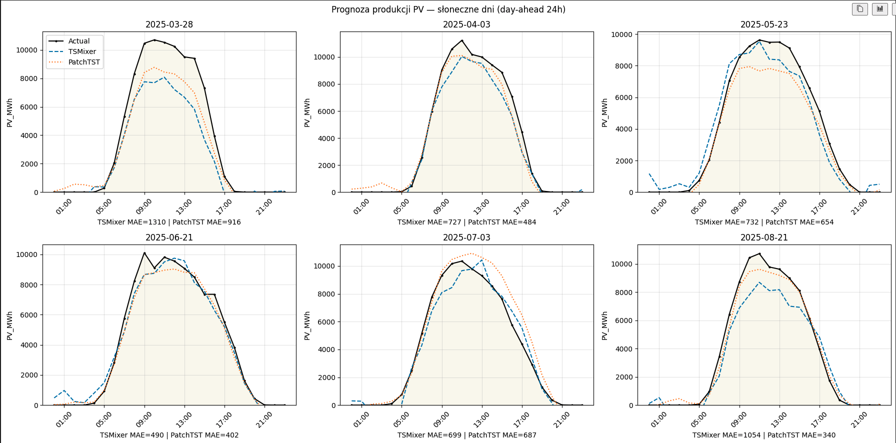

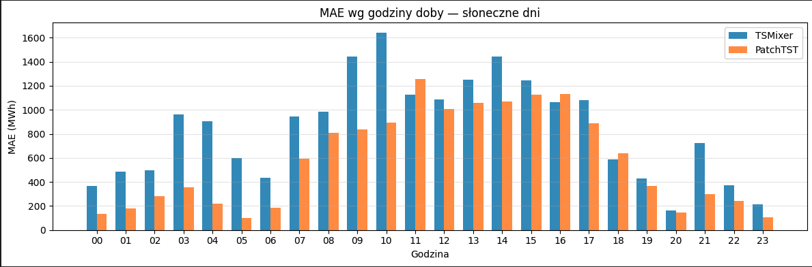

**Wnioski:**

- Względem walidacji 7-dniowej widać wyraźną poprawę – zwłaszcza współczynnika R² (momentami powyżej 0.9). Wynika to ze specyfiki dni bezchmurnych: mają one silną, stabilną zmienność dobową(od zera w nocy do maksimum w południe), którą model dobrze odwzorowuje.
- Mimo wysokiego R², bezwzględne błędy (MAE) w godzinach szczytu pozostają duże ze względu na dużą skalę generowanej mocy.
- Podwyższone MAPE dla PatchTST wynika z błędów w godzinach nocnych, gdzie produkcja jest bliska zeru – nawet niewielki błąd bezwzględny daje ogromny błąd procentowy.
- Również w tym teście **PatchTST okazuje się lepszy** – architektura oparta na transformerze lepiej radzi sobie z długim horyzontem (h=24) niż TSMixer.

### 2.7. Podsumowanie części PV

Spośród dwóch przetestowanych architektur **PatchTST konsekwentnie osiąga lepsze wyniki** w obu scenariuszach walidacji. Oba modele wyraźnie przewyższają naiwny baseline. Analiza SHAP i LIME potwierdza, że model wykorzystuje sensowne cechy (promieniowanie słoneczne, cechy czasowe, krajowe agregaty pogodowe) oraz pełen kontekst 48-godzinnego okna.

---

## 3. Prognozowanie produkcji wiatrowej (FW)

### 3.1. Konfiguracja eksperymentu i modele

W danych, gdzie brakowało wartości produkcji i odpowiadającyh jej cech użyto interpolacji aby wyliczyć te wartości. Dane z kilku najnowszych dni posiadały braki, więc zostały ucięte do pierwszego dnia, w którym ich nie brakowała.

Parametry użyte do konfiguracji modelu były podobne jak w produkcji PV, jedynie liczba kolumn się różniła, gdzie liczba cech wejściowych wynosiła 186.

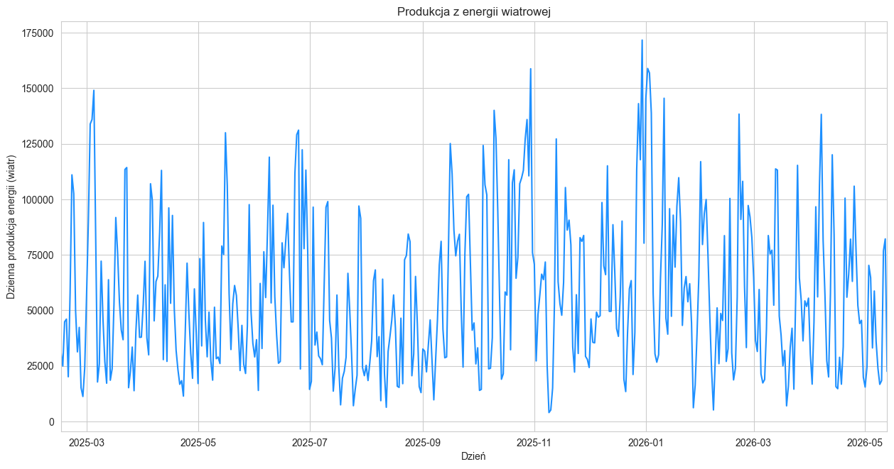

Po czym podzielono zbiór danych na zzbiór walidacyjny - 8 dni wstecz bez ostatniego czyli 168 godzin, zbiór testowy - ostatnie 24 godziny, które nie były dodane do zbioru walidacyjnego, zbiór treningowy pozostała reszta

Użyto jedynie modelu **TSMixer** oparte na [artykule](https://arxiv.org/abs/2303.06053).

### 3.2 Wyniki

**Metryki:**
|MSE|RMSE|MAPE|
|---|--|--|
|0.5876|0.7098|89.96%|

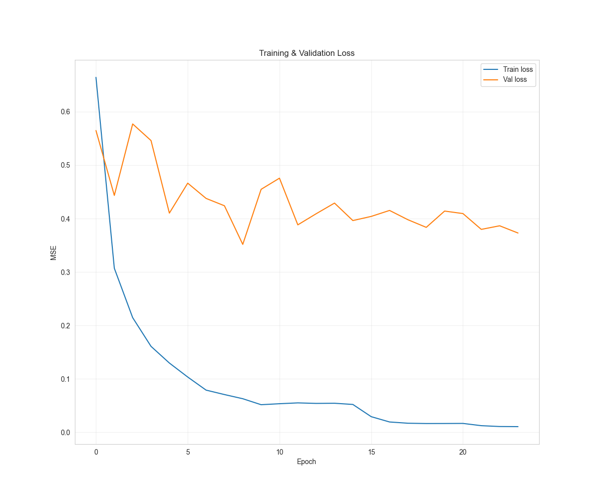

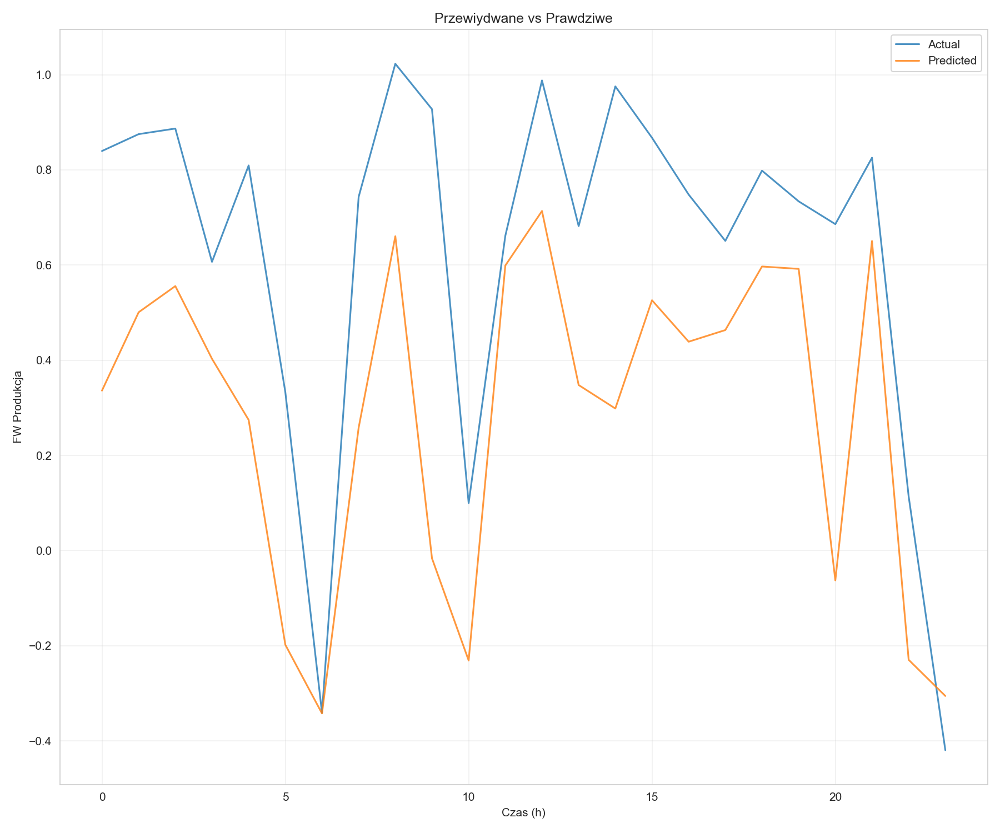

### 3.3 Analiza ważności cech

Na podstawie wytrenowanego modelu stworzono wykresy SHAP pokazujące najważniejsze cechy, które miay wpływ na decyzje modelu.

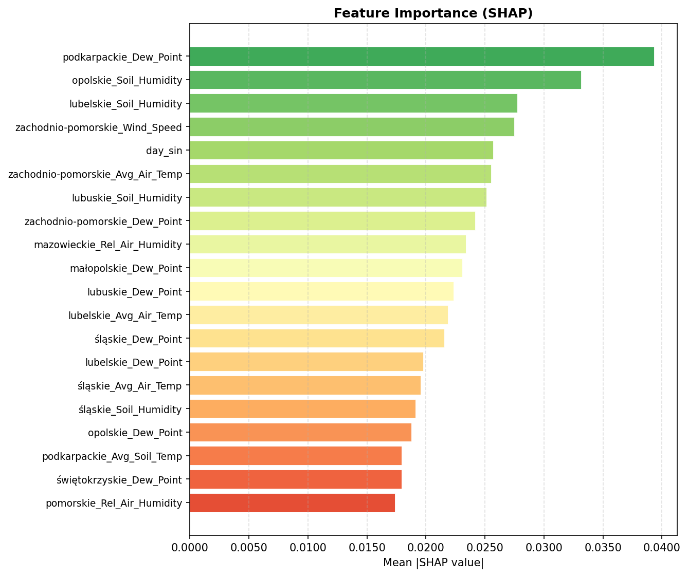

Wykres roju dla cech

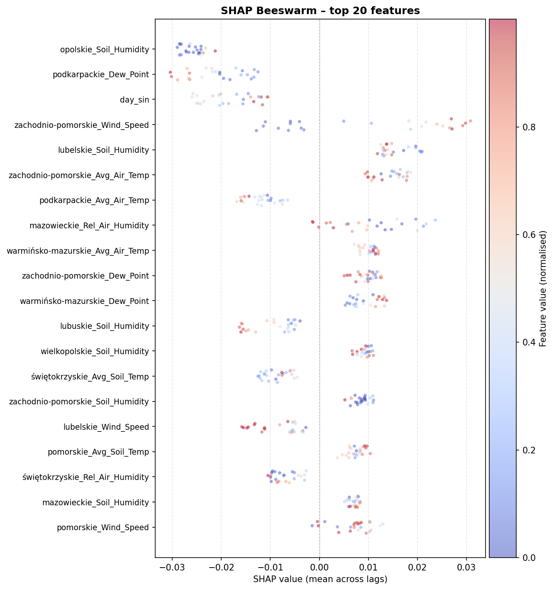

Jak widać dla tych 20 cech ich wartości bezwzględne SHAP nie są aż takie duże, może to być spowodowane ilością cech użytych do predykcji.

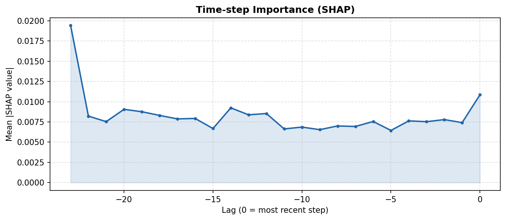

Natomiast jak widzimy na powyższym wykresie dla modelu wartość z 24 godzin przed predykcją była najważniejsza spośród wszystkich innych, 1 godzina przed była mniej ważna, ale druga najważniejsz ze wszystkich.

### 3.4 Wyniki na dniach najbardziej wietrznych

Spośród całego zbioru danych wybrano 6 najbardziej wietrznych dni i dla nich przeprowadzono predykcję.

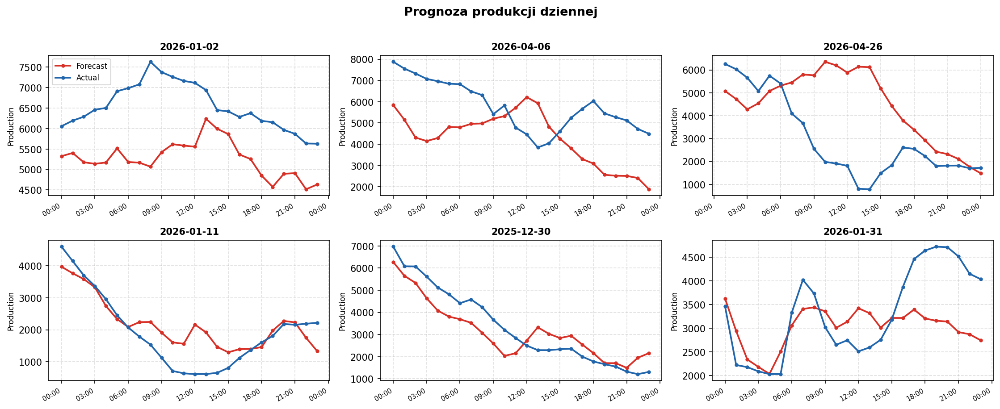

Jak widać część z tych dni model lepiej przewiduje od innych.

### 3.5 Podsumwanie

Model dość dobrze radzi sobie z zadaniem przewidywania produkcji. Jedynią wysoką metryką jest MAPE, gdzie również dla przypadku PV wartośći jej oscylują w okolicach 90%. Prawdopodobnie model mógłby osiągnąc lepsze wyniki jeśli zrobiono by jakąś ekstrakcje dodatkowych cech oraz selekcje tylko tych najważniejszy, ale wiązałoby się to z wysokim kosztem obliczeniowym.
